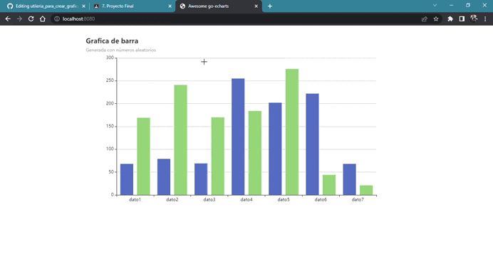

###Fecha: 03/06/2022

### Se desea crear una utilería para crear gráficas. Esta va a tener dos opciones:
### 1.- Crearlas a partir de valores generados de manera aleatoria.
### 2.- Crearlas a partir de un archivo CSV existente.


#### Comenzamos el proyecto con la creacion del archivo main en Go

```GO
package main

import ()
func main() {
	
}
 ```
 #### Se añadieron las opciones de casos que se presentaran
 
  ```GO
  func main() {
  op1 := os.Args[1]
	op2 := os.Args[2]
	if op2 == "--generate" {
		switch op1 {
		case "--bar":
		case "--line":	
		case "--pie":
		}
	} else {

		switch op1 {
		case "--bar":
		case "--line":
		case "--pie":

		}
	}
}
   ```
#### Generamos una funcion para crear los items randoms para la opcion de grafica de barras con la siguiente función
 ```GO
  //Generea la grafica de barras con rand
func generateBarItemsrand() []opts.BarData {
	items := make([]opts.BarData, 0)
	for i := 0; i < 7; i++ {
		items = append(items, opts.BarData{Value: rand.Intn(300)})
	}
	return items
}
 ```
 ### Generamos la funcion para ordenar los datos de la grafica
 ```GO
  
func barGraph(w http.ResponseWriter, _ *http.Request) {
	bar := charts.NewBar()
	bar.SetGlobalOptions(charts.WithTitleOpts(opts.Title{
		Title:    "Grafica de barra ",
		Subtitle: "Generada con números aleatorios",
	}))
	bar.SetXAxis([]string{"dato1", "dato2", "dato3", "dato4", "dato5", "dato6", "dato7"}).
		AddSeries("Category A", generateBarItemsrand()).
		AddSeries("Category B", generateBarItemsrand())
	bar.Render(w)
}
 ```
 #### Despues el opción correspondientes mandamos los datos al servidor local para ser mostrados en un html
 ```GO
 case "--bar":
			http.HandleFunc("/", barGraph)
			http.ListenAndServe(":8080", nil)
   ```
   
   ### Repetimos con la grafica de lineas y de pastel 
```GO
    case "--line":
			http.HandleFunc("/", httpserver)
			http.ListenAndServe(":8080", nil)
		case "--pie":
			http.HandleFunc("/", pieGraph)
			log.Fatal(http.ListenAndServe(":8080", nil))
		default:
			log.Println("Opciones no encontradas...")
		}
```
 
 #### Con esto podemos ejecutar ```$go run graphgen --bar --generate``` y se mostrara una grafica en el servidor local ``` http://localhost:8080/ ```
 


#### Una vez activado el servidor se genera una grafica con datos aleatorios.



#### Este procedimiento tambien se aplica para la grafica de linea ```$go run graphgen --line --generate```


#### Grafica de pastel  ```$go run graphgen --pie --generate```

 
 
   
### Ahora trabajaramos con estas mismas opciones de graficas peero ahora con un archivo CSV 

#### Para comenzar necesitamos leer el archivo CSV y convertirlo en una matriz para eso usamos la siguiente función
```GO
func ReadCSVFile() [][]string {
	// CSV Reader
	file, err := os.Open("./data.csv")
	if err != nil {
		fmt.Println(err)
	}
	reader := csv.NewReader(file)
	reader.LazyQuotes = true
	records, err := reader.ReadAll()
	if err != nil {
		log.Fatal(err)
	}
	return records
}
```
#### Generamos la matriz con los datos del archivo con la siguiente función 
```Go

func generateBarFile() []opts.BarData {
	items := make([]opts.BarData, 0)
	sum := 0

	for i := 0; i < len(ReadCSVFile()[0]); i++ {
		sum = 0
		for j := 1; j < len(ReadCSVFile()); j++ {
			temp, _ := strconv.Atoi(ReadCSVFile()[j][i])
			sum += temp
		}
		value := strconv.Itoa(sum)
		items = append(items, opts.BarData{Value: value})
	}
	return items
}
```
#### La siguiente funcion genera la grafica de barras con los datos optenidos del arvhivo
```GO

func barGraphcsv(w http.ResponseWriter, _ *http.Request) {

	bar := charts.NewBar()
	//opciones globales
	bar.SetGlobalOptions(charts.WithTitleOpts(opts.Title{
		Title:    "GRAFICA DE BARRAS",
		Subtitle: "Grafica generada con archivo csv",
	}))

	//poner datos
	bar.SetXAxis([]string{"Enero", "Febrero", "Marzo", "Abril", "Junio", "Julio"}).
		AddSeries("Category A", generateBarFile()).
		AddSeries("Category B", generateBarFile()).
		SetSeriesOptions(charts.WithLineChartOpts(opts.LineChart{Smooth: true}))
	bar.Render(w)
}
```
#### Esta función manda los datos al servidor local y se genera la gráfica ejecutando ```$go run graphgen --bar data.csv```


#### Para la grafica de linea es el mismo procedimiento y hacemos uso de las funcones ya creadas anteriormente
```GO
func lineGraphcsv(w http.ResponseWriter, _ *http.Request) {
	line := charts.NewLine()
	line.SetGlobalOptions(
		charts.WithInitializationOpts(opts.Initialization{Theme: types.ThemeWesteros}),
		charts.WithTitleOpts(opts.Title{
			Title:    "Grafica de lineas",
			Subtitle: "Generada con un archivo CSV",
		}))
	line.SetXAxis([]string{"Enero", "Febreo", "Marzo", "Abril", "Mayo", "Junio", "Julio"}).
		AddSeries("Category A", generateLineItemscsv()).
		AddSeries("Category B", generateLineItemscsv()).
		SetSeriesOptions(charts.WithLineChartOpts(opts.LineChart{Smooth: true}))
	line.Render(w)
}
```
#### Ejecutamos para comprobar ```$go run graphgen --line data.csv```


